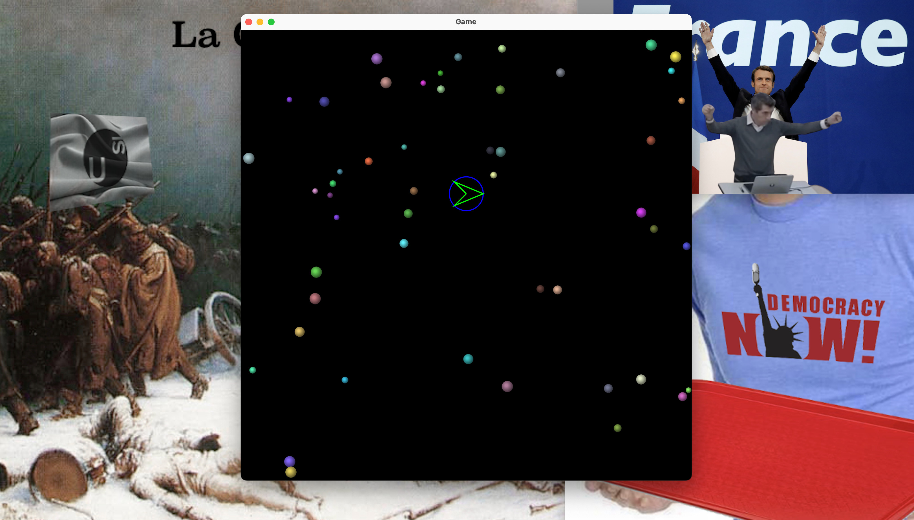

> A strange game. The only winning move is not to play.
> 
> –War Games, 1983

# Flying balls

Ball games (or ballgames), also ball sports, are any form of game or sport which
feature 1 (one) or more balls as part of play.

These include games such as football, cricket, baseball, basketball, and flying
balls. Such games have diverse rules and histories and are of mostly unrelated
origins. Ball games can be defined in several broad types, and generally try to
measure how well a player can hit a ball.

## Rules

To play flying balls is easy with your friend keyboard. Just open the game and
use the arrow keys to control the flying balls through The Force.
The Force was an energy field created by all life that connected everything in
the universe, and was known by a variety of names throughout galactic history.

The rules to play to play this game are very simple:

1. The balls should never fly beyond the boundaries of the window
2. Use The Force responsibly, _with great power comes great responsibility_

## History

Flying balls is an ancient tradition of the _Università della Svizzera
italiana_, whose origins are shrouded in mythicism. Historian recall of its
first appearances during the System Programming courses, where it was briefly
shown as a demonstration of the power of the almighty superior C language.

## Building

The hour is upon us, finally the source code of this elusive game has finally
be released for us all to admire and enjoy. We shall then document the arduous
process required to experience the engaging game-play of flying balls on your
very own machine:

1. Obtain the following dependencies on your machine:
    - `make`, `pkg-config`, `gtk3`, `cc`
2. Execute the following command in your shell environment
    - `make`
3. When your machine has finally bestowed upon you the executable binary
   file that contains the game, execute it
   - `./balls`

## Appearance

